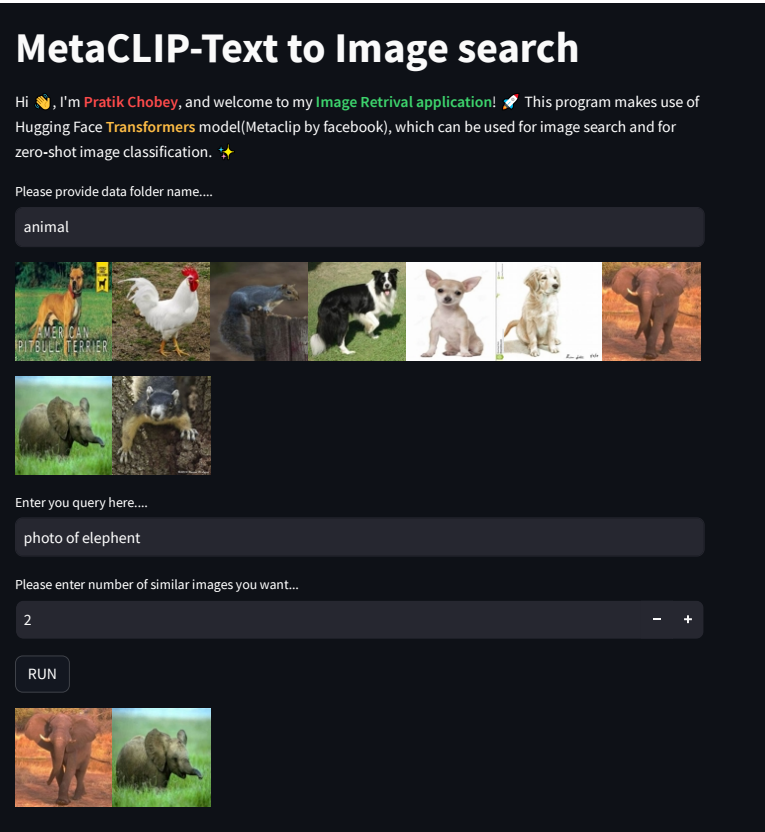

# MetaClLIP
MetaCLIP by Meta AI. is a new approach to language-image pre-training that focuses on data curation. It takes a raw data pool and metadata derived from CLIP's concepts to produce a balanced subset of data based on the metadata distribution.

You can use the raw model for linking images with text in a shared embedding space. This enables things like zero-shot image classification, text-based image retrieval, image-based text retrieval, etc.

* What is CLIP?
  
  * Contrastive Language-Image Pre-training (CLIP forshort) is a state-of-the-art model introduced by OpenAl in February. 
  * CLIP is a neural network trained on about 400 million (text and image) pairs.
  * Training uses a contrastive learning approach that aims to unify text and images, allowing tasks like image classification to be done with text-image similarity.
 
* CLIP Architecture:
  * Two encoders are jointly trained to predict the correct pairings of abatch of training (image, text) examples.
    
    * The text encoder's backbone is a transformer model, and the base size uses 63 millions- parameters,12 layers, and a 512-wide modelcontaining 8 attention heads.
    * The image encoder, on the other hand, uses both a Vision Transformer (ViT) and a ResNet50 as its backbone, responsible for generating the feature representation of the image.

---

## Image Search

* Run Code:
  * Install:
    1. clone the repo :
       'git clone https://github.com/pratik-choubey/MetaClLIP_Use.git'
    2. install the requirements: 'pip install -r requirements.txt'
    3. !pip install streamlit
    4. Run app:
       'streamlit run app.py'
---

